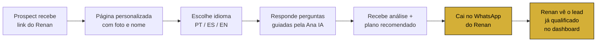
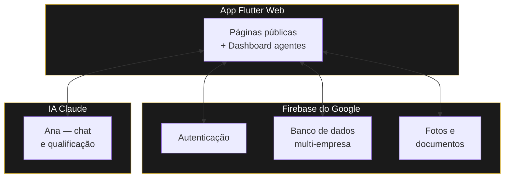
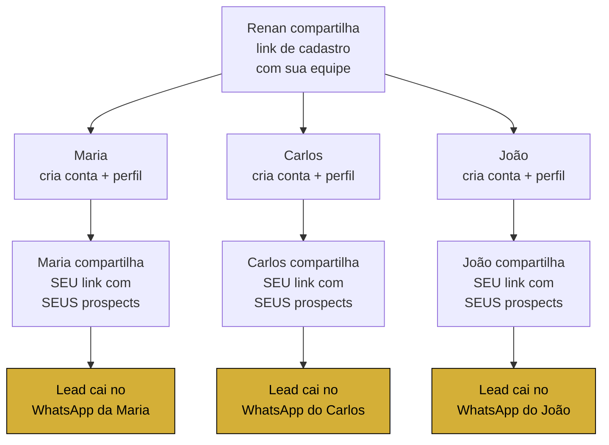
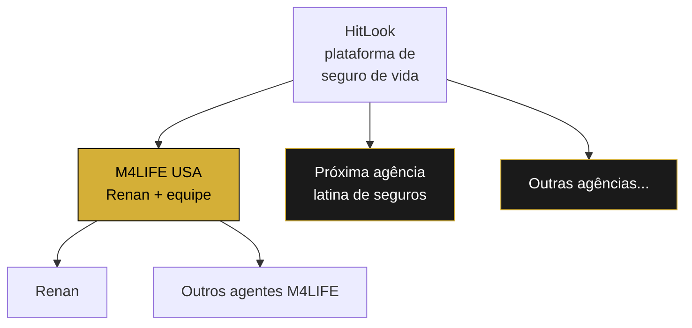

# HitLook — Plataforma de Captação de Leads para Agentes Latinos

**Reunião com Renan — Maio 2026**

---

## O que é, em uma frase

Cada agente do M4LIFE tem **sua própria página personalizada** onde prospectos respondem perguntas em português, espanhol ou inglês, recebem uma análise educacional via IA, e **chegam no seu WhatsApp já qualificados**.

---

## Como funciona — o caminho do lead

**Diferença vs ferramenta genérica:** o prospect vê a foto e o nome do agente **antes de qualquer pergunta**. Isso cria confiança que landing page padrão não consegue.

---

## O que o Renan vai ter

### Sua página pública
- URL personalizada: `hitlook-app.web.app/a/renan`
- Foto, nome e apresentação dele
- Disponível em português, espanhol e inglês
- Funciona em qualquer celular e desktop

### Seu dashboard privado
- Login com email e senha
- Lista de todos os leads que chegaram, em ordem cronológica
- Para cada lead: nome, telefone, idade, score de proteção, plano recomendado, idioma
- Status: novo, contatado, ganho, perdido

### O fluxo de qualificação
- 6 perguntas inteligentes (dependentes, renda, cobertura atual, dívidas, etc.)
- Score automático de 5 a 95 (Vulnerável → Bem Protegido)
- Plano recomendado entre Term Life Essential, Term Life Family, Whole Life Family
- Calculadora familiar interativa (renda × anos + dívidas)
- Disclaimer educacional em toda tela (compliance Florida DFS)

### A Ana IA
- Chat conversacional após o questionário
- Responde dúvidas do prospect em tempo real
- Educa sobre os planos, **não dá conselho de seguros** (compliance)
- Sempre encaminha pro agente humano licenciado

### WhatsApp como ponto final
- Botão "Falar com consultor" abre WhatsApp do Renan
- Mensagem **já vem pré-preenchida** com nome do prospect, score, plano
- Renan recebe lead "esquentado", não frio

---

## O que vem do Renan — material pra alimentar a Ana IA

Pra Ana responder bem em nome do Renan, precisa de material dele:

1. **Apresentação pessoal** — quem é, há quanto tempo trabalha, especialidades
2. **Diferenciais** — por que escolher ele e não outro agente
3. **Casos reais** — sem nomes, exemplos de famílias que ele atendeu e como resolveu
4. **Materiais de treinamento** que ele recebe das seguradoras (PDFs, manuais)
5. **Perguntas frequentes** que ele já ouviu mil vezes e quer respondidas automaticamente
6. **Tom de voz** — formal? familiar? Vai influenciar como a Ana fala

Com isso a Ana deixa de ser genérica e passa a "soar como ele".

---

## A plataforma — arquitetura simples

Tudo roda em infraestrutura do Google. Backup automático. SSL nativo. Escalável.

---

## Equipe M4LIFE — como cada agente seu trabalha

A equipe do Renan não depende dele pra fechar todo lead. Cada agente tem **autonomia total** sobre os próprios leads:

**Resultado:** o Renan **não vira gargalo**. Cada agente fecha o próprio lead, no próprio WhatsApp, no próprio ritmo.

### Hoje (piloto inicial — semana 1)
- Cada agente da equipe **cria a própria conta** no app
- Cada um vê **apenas os próprios leads** no dashboard
- Renan **compartilha** o link de cadastro com a equipe

### Mês 2 — Painel de Equipe pro Renan
- Renan, como **admin da M4LIFE**, vai ter uma aba **"Equipe"** no dashboard dele
- Vai ver **todos os leads** de **todos os agentes** da M4LIFE em uma tela só
- **Ranking** de quem está produzindo mais
- **Métricas** de conversão por agente
- **Convite por email**: digita o email do novo agente, ele recebe um link já vinculado à M4LIFE

> Isso é construído depois que o piloto começa, baseado no **feedback do Renan** sobre o que ele mais precisa ver.

---

## Como o multi-agência funciona

Cada agência tem seu próprio espaço **isolado**. Os leads do Renan **só o Renan vê** (e o admin da M4LIFE). Dados de outras agências nunca cruzam com os da M4LIFE.

**A M4LIFE é a agência piloto** — primeira a entrar. Depois que estiver rodando com a equipe do Renan, abrimos pra outras agências latinas de seguro de vida nos EUA.

---

## Cronograma honesto

| Quando | O que entrega |
|---|---|
| **Esta semana** | WhatsApp CTA + página personalizada do Renan funcionando ponta a ponta |
| **Próximas 2 semanas** | Ana IA treinada com material do Renan + slot de upload de documentos no dashboard |
| **Mês 1** | Renan + 4 agentes do M4LIFE usando, métricas de conversão |
| **Mês 2** | Painel de Equipe pro Renan (admin M4LIFE) + ajustes pelo feedback |
| **Mês 3-6** | Abertura pra outras agências latinas de seguro de vida nos EUA |

---

## Parceria de validação — M4LIFE como agência piloto

**O acordo entre Diego e Renan:**

- **Acesso 100% grátis por 60 a 90 dias** pra Renan + sua equipe (até 5 agentes)
- Sem cartão de crédito, sem contrato, sem pegadinha
- Em troca, M4LIFE é a **agência piloto** que valida o produto antes da abertura comercial
- Renan fica com **preço locked-for-life** quando o pagamento começar: **$47/mês por agente**, vitalício

**Comparáveis no mercado americano:** AgencyZoom $99–249, Better Agency $129–299. Quando abrir comercialmente, HitLook vai ser $97/mês padrão. O Renan vai estar travado em $47 pra sempre.

---

## O que define sucesso no piloto

Pra Renan e Diego saberem que o piloto funcionou, três critérios objetivos:

| Métrica | Meta em 60-90 dias |
|---|---|
| **Leads gerados** via app | Pelo menos 30 leads qualificados no total da M4LIFE |
| **Agentes ativos** | Pelo menos 3 dos 5 agentes usando ≥ 1x/semana |
| **Apólice fechada** | Pelo menos 1 apólice originada do HitLook (vinda de lead do app) |

Se bater os 3, o piloto é validado e:
- Renan migra pro plano $47/agente locked-for-life **OU**
- Renan apresenta o HitLook pra 3 outras agências latinas (escolha dele)

Se não bater, **a gente conversa antes de continuar**. Não tem amarração. Renan não fica preso ao que não está funcionando, Diego não fica construindo no vazio.

---

## O que pedimos do Renan nesta primeira fase

1. **Comprometimento** de usar o produto com a equipe — mínimo de 1 sessão por semana
2. **Material** pra alimentar a Ana (lista acima)
3. **Feedback honesto e direto** — o que ajuda, o que atrapalha, o que falta
4. **Depoimento** (texto ou vídeo curto) se gostar — material que ajuda Diego a vender pras próximas agências
5. **Indicações** de outras agências latinas no fim do piloto, se o resultado for bom

---

## Por que isso ganha do concorrente

**Agências latinas hoje não têm ferramenta deles.** Usam AgencyZoom (inglês, americano, caro), planilhas no Google, ou nada. O HitLook é **multilíngue de nascença**, com a Ana que **fala como elas falam**, focado em conversa por WhatsApp (canal número 1 da comunidade latina nos EUA).

**A vantagem real:** Diego mora o problema. Não é tradução de produto americano.

---

*Documento preparado pra reunião com Renan — Maio 2026*
*HitLook / M4LIFE USA — piloto*
